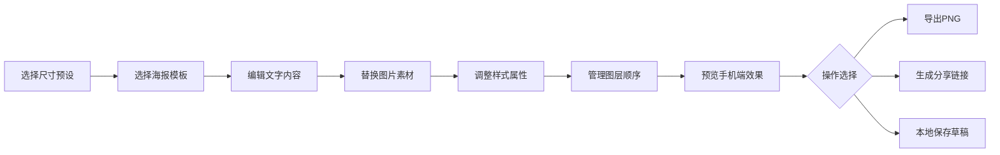

## 1. 产品概述
社媒海报创意设计工具，为品牌运营人员提供一站式海报快速制作能力，无需专业设计技能即可组合出高质量社交媒体海报草稿。
- 核心价值：降低设计门槛，提升运营效率，保持品牌视觉一致性
- 目标用户：品牌运营人员、市场专员、内容创作者
- 解决痛点：设计资源紧张、反复沟通成本高、品牌风格不统一

## 2. 核心功能

### 2.1 功能模块
1. **画布编辑器**：核心编辑区域，支持拖拽、缩放、选中元素
2. **模板库**：预设海报模板，一键套用快速开始
3. **素材面板**：图片素材、形状、图标库，支持上传品牌Logo
4. **图层面板**：图层管理，支持锁定、隐藏、排序
5. **属性面板**：文字/图片样式调整，字体、颜色、对齐、间距、透明度、阴影
6. **顶部工具栏**：尺寸预设、撤销重做、手机预览、导出
7. **本地存储**：草稿自动保存，支持重新编辑
8. **分享系统**：生成只读预览链接

### 2.2 页面详情
| 页面名称 | 模块名称 | 功能描述 |
|-----------|-------------|---------------------|
| 主编辑页 | 画布区域 | 可视化海报编辑，实时预览，支持元素拖拽和变换 |
| 主编辑页 | 左侧面板 | 模板库、素材库、上传管理，标签页切换 |
| 主编辑页 | 右侧面板 | 图层面板、属性编辑面板，标签页切换 |
| 主编辑页 | 顶部工具栏 | 尺寸选择、撤销重做、复制变体、手机预览、导出PNG、生成分享链接 |
| 预览页 | 分享预览 | 只读模式查看海报，支持手机端适配预览 |

## 3. 核心流程
用户选择尺寸预设 → 选择或跳过模板 → 添加/编辑文字和图片 → 调整样式属性 → 管理图层 → 预览手机端效果 → 导出PNG或生成分享链接 → 本地保存草稿

## 4. 用户界面设计

### 4.1 设计风格
- **主色调**：深靛蓝 (#1e1b4b) 作为主色，搭配珊瑚橙 (#f97316) 作为强调色
- **背景**：采用分层设计，侧边栏深色渐变，画布区域浅灰网格背景
- **按钮风格**：精致圆角按钮，悬停时微放大+阴影增强，按下时缩小反馈
- **字体**：标题使用 Playfair Display 展示字体，正文使用 Inter 无衬线字体
- **布局风格**：三栏布局（左侧面板 | 中央画布 | 右侧面板），顶部全局工具栏
- **图标风格**：Lucide 线性图标，统一 18px 尺寸，颜色与文字层级保持一致

### 4.2 页面设计概述
| 页面名称 | 模块名称 | UI Elements |
|-----------|-------------|-------------|
| 主编辑页 | 画布区域 | 白色画布带投影，选中元素显示变换控制点，网格背景辅助对齐 |
| 主编辑页 | 左侧面板 | 标签页切换（模板/素材/上传），卡片式展示缩略图，悬停高亮 |
| 主编辑页 | 右侧面板 | 图层列表带拖拽排序，属性面板分区展示，滑块+输入框组合调整数值 |
| 主编辑页 | 顶部工具栏 | 左对齐功能按钮组，右对齐导出操作区，深色底衬托白色图标 |
| 预览页 | 分享预览 | 居中展示海报，底部渐变遮罩显示品牌信息 |

### 4.3 响应式
- 桌面端（默认）：完整三栏布局，画布居中显示
- 平板端：左侧/右侧面板可折叠收起，画布自适应
- 移动端：重点保留画布和核心操作，面板改为底部抽屉式

### 4.4 动效设计
- 页面加载：顶部工具栏先出现，随后左右面板滑入，最后画布淡入
- 元素选中：边框动画发光，控制点弹性出现
- 拖拽操作：被拖拽元素半透明，放置位置有指示线
- 按钮交互：悬停时背景色过渡+轻微上浮，点击时缩放反馈
- 面板切换：内容区淡入淡出切换，标签下划线滑动过渡
