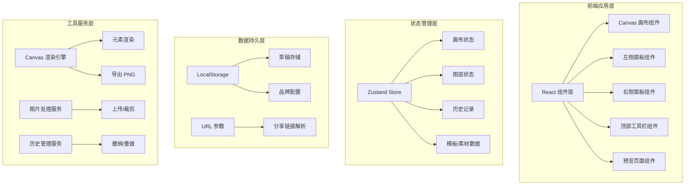

## 1. 架构设计



## 2. 技术描述
- **前端框架**：React@18 + TypeScript
- **构建工具**：Vite@5
- **样式方案**：Tailwind CSS@3
- **状态管理**：Zustand@4
- **图标库**：Lucide React
- **画布渲染**：HTML5 Canvas API + 自定义渲染引擎
- **图片导出**：html2canvas
- **数据存储**：LocalStorage（浏览器本地存储）
- **无后端依赖**：纯前端应用，所有数据存储在浏览器本地

## 3. 目录结构

```
src/
├── components/
│   ├── canvas/              # 画布相关组件
│   │   ├── Canvas.tsx       # 主画布组件
│   │   ├── CanvasRenderer.ts # 渲染引擎
│   │   └── ElementControls.tsx # 元素控制点
│   ├── panels/              # 面板组件
│   │   ├── LeftPanel.tsx    # 左侧面板（模板/素材/上传）
│   │   ├── RightPanel.tsx   # 右侧面板（图层/属性）
│   │   ├── TemplateLibrary.tsx # 模板库
│   │   ├── MaterialPanel.tsx # 素材面板
│   │   ├── LayerPanel.tsx   # 图层面板
│   │   └── PropertyPanel.tsx # 属性编辑面板
│   ├── toolbar/             # 工具栏组件
│   │   ├── TopToolbar.tsx   # 顶部工具栏
│   │   ├── SizePresets.tsx  # 尺寸预设
│   │   └── ExportPanel.tsx  # 导出面板
│   └── common/              # 通用组件
│       ├── Button.tsx
│       ├── Tabs.tsx
│       ├── Slider.tsx
│       └── ColorPicker.tsx
├── store/                   # Zustand 状态管理
│   ├── useCanvasStore.ts    # 画布状态
│   ├── useHistoryStore.ts   # 历史记录
│   └── useBrandStore.ts     # 品牌配置
├── hooks/                   # 自定义 Hooks
│   ├── useCanvas.ts         # 画布操作
│   ├── useDragDrop.ts       # 拖拽
│   └── useLocalStorage.ts   # 本地存储
├── utils/                   # 工具函数
│   ├── canvasRenderer.ts    # 画布渲染
│   ├── exporter.ts          # 导出工具
│   ├── templates.ts         # 模板数据
│   └── materials.ts         # 素材数据
├── types/                   # TypeScript 类型定义
│   ├── canvas.ts
│   ├── elements.ts
│   └── index.ts
├── pages/                   # 页面组件
│   ├── Editor.tsx           # 编辑器主页面
│   └── Preview.tsx          # 分享预览页面
├── App.tsx
├── main.tsx
└── index.css
```

## 4. 核心数据模型

### 4.1 画布元素类型
```typescript
interface BaseElement {
  id: string;
  type: 'text' | 'image' | 'shape' | 'logo';
  x: number;
  y: number;
  width: number;
  height: number;
  rotation: number;
  opacity: number;
  locked: boolean;
  visible: boolean;
  zIndex: number;
  shadow?: ShadowConfig;
}

interface TextElement extends BaseElement {
  type: 'text';
  content: string;
  fontSize: number;
  fontFamily: string;
  fontWeight: number;
  color: string;
  textAlign: 'left' | 'center' | 'right';
  lineHeight: number;
  letterSpacing: number;
}

interface ImageElement extends BaseElement {
  type: 'image';
  src: string;
  objectFit: 'cover' | 'contain' | 'fill';
  borderRadius: number;
}

interface ShadowConfig {
  offsetX: number;
  offsetY: number;
  blur: number;
  color: string;
}
```

### 4.2 画布状态
```typescript
interface CanvasState {
  width: number;
  height: number;
  backgroundColor: string;
  elements: CanvasElement[];
  selectedElementId: string | null;
  zoom: number;
}
```

### 4.3 历史记录
```typescript
interface HistoryState {
  past: CanvasState[];
  future: CanvasState[];
}
```

## 5. 路由定义
| 路由 | 用途 |
|-------|---------|
| / | 编辑器主页面 |
| /preview/:id | 分享预览页面（只读） |

## 6. 核心功能实现方案

### 6.1 画布渲染
- 使用 HTML5 Canvas API 进行元素绘制
- 采用分层渲染机制，按 zIndex 顺序绘制元素
- 选中元素额外绘制控制点和边框

### 6.2 元素交互
- 鼠标事件监听实现拖拽、缩放、旋转
- 键盘快捷键支持（Delete 删除，Ctrl+Z 撤销等）
- 碰撞检测和边界限制

### 6.3 撤销重做
- 基于 Zustand 中间件实现状态快照
- 操作前保存当前状态到历史栈
- 限制历史记录最大步数（默认 50 步）

### 6.4 本地存储
- 使用 LocalStorage 存储草稿数据
- 自动保存（操作后 3 秒防抖保存）
- 支持多个草稿管理

### 6.5 分享功能
- 将画布数据压缩编码到 URL 参数中
- 预览页面解析 URL 参数还原画布
- 只读模式禁止编辑操作

### 6.6 图片导出
- 使用 html2canvas 将 Canvas 转换为图片
- 支持 1x/2x/3x 倍率导出
- 自动下载 PNG 文件
